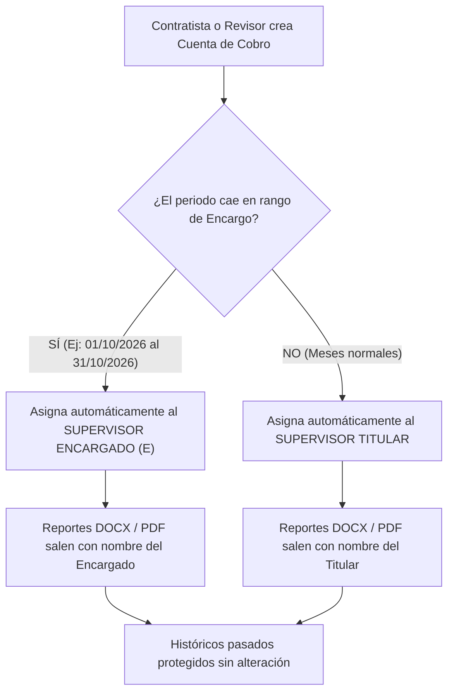

# Propuesta y Plan Técnico: Gestión Automatizada de Supervisión por Encargo Temporal

## 1. Contexto y Justificación
En la gestión contractual de la entidad, los supervisores titulares frecuentemente se ausentan de manera transitoria por:
* Vacaciones programadas.
* Licencias (maternidad, luto, remuneradas/no remuneradas).
* Incapacidades médicas.
* Comisiones de servicio.

Durante estas ausencias, la entidad designa un **Supervisor Encargado (E)** para autorizar y firmar las cuentas de cobro y los informes mensuales de supervisión.

### El problema identificado
Cuando la asignación del supervisor se actualiza directamente en la matriz general de contratos (Excel), el sistema actualiza el titular del contrato de forma global. Esto provoca que **las cuentas de meses anteriores (que ya fueron firmadas y pagadas con el titular) se alteren indebidamente**, mostrando al encargado retroactivamente. Asimismo, cuando el titular regresa de sus vacaciones, se requiere otro reproceso manual para devolver los contratos a su estado original.

---

## 2. Solución Propuesta: Módulo de "Encargos y Delegaciones Temporales"

Implementar una funcionalidad donde el área de Contratación o el Administrador del Sistema registre formalmente los períodos de encargo temporal, de modo que el software asigne de manera 100% automática al supervisor correspondiente según el período de la cuenta.

---

## 3. Estructura de Información Requerida (Ficha del Encargo)

Para registrar un encargo en el sistema, se solicitarían los siguientes datos:

| Campo | Descripción | Ejemplo |
| :--- | :--- | :--- |
| **Supervisor Titular** | Funcionario de planta que sale a vacaciones/licencia | *Claudia Patricia Vargas Orozco* |
| **Supervisor Encargado** | Funcionario que asume temporalmente la supervisión | *Adriana Marcela León Botina* |
| **Fecha Inicio Encargo** | Fecha exacta en que inicia la delegación | *01/10/2026* |
| **Fecha Fin Encargo** | Fecha exacta en que finaliza la delegación | *31/10/2026* |
| **Acto Administrativo** | Documento que soporta jurídicamente el encargo *(Opcional)* | *Resolución No. 4121.010.21.0543 de 2026* |
| **Alcance** | ¿Aplica a todos los contratos del titular o a una lista específica? | *Todos los contratos del titular* |

---

## 4. Preguntas Clave para el Área de Contratación

Para validar la viabilidad y alcance con los coordinadores del área de Contratación, sugerimos formularles las siguientes preguntas:

1. **Formalización jurídica:**  
   *¿Mediante qué acto administrativo se formalizan los encargos por vacaciones o licencias en la entidad?*  
   *(Ejemplo: ¿Resolución de Talento Humano, designación por memorando, o acta interna?)*

2. **Alcance del encargo:**  
   *Cuando un supervisor sale a vacaciones, ¿el funcionario encargado asume **todos** los contratos que tenía a cargo el titular, o existen casos donde se dividen entre varios funcionarios?*

3. **Texto en los informes mensuales:**  
   *En el informe de supervisión y en la certificación de cumplimiento del mes encargado:*  
   - ¿Basta con que aparezca el nombre del funcionario y su cargo con **(E)**?  
   - ¿O el área jurídica exige que se cite expresamente el número de resolución de encargo en el pie de firma? *(Ej: "En calidad de supervisor encargado según Resolución No. XXXX")*.

4. **Flujo de notificación:**  
   *¿Con cuántos días de anticipación Talento Humano o Contratación expide y conoce las fechas del encargo para ingresarlas al sistema antes de que los contratistas radiquen sus cuentas?*

---

## 5. Beneficios para la Entidad

* **Seguridad Jurídica Total:** Cada informe mensual conserva de por vida el nombre del supervisor que ejerció la supervisión en esa cuota específica. Cumplimiento estricto ante auditorías de Contraloría y Personería.
* **Cero Reprocesos:** No es necesario editar la matriz de contratos cada vez que alguien se va o regresa de vacaciones.
* **Transparencia para los Contratistas:** El contratista no tiene que adivinar a quién dirigir la cuenta; el sistema sabe automáticamente a quién asignarla según la fecha del período a cobrar.
